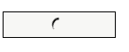

# button
[](https://github.com/substrate-system/button/actions/workflows/nodejs.yml)
[](README.md)
[](README.md)
[](package.json)
[](https://packagephobia.com/result?p=@substrate-system/button)
[](https://bundlephobia.com/package/@substrate-system/button)
[](https://semver.org/)
[](./CHANGELOG.md)
[](LICENSE)


A button web component, with a visual "loading" state.

[See a live demo](https://substrate-system.github.io/button/)



<details><summary><h2>Contents</h2></summary>

<!-- toc -->

- [Install](#install)
- [Dependencies](#dependencies)
- [API](#api)
  * [ESM](#esm)
  * [Common JS](#common-js)
- [CSS](#css)
  * [Bundler](#bundler)
  * [CSS import](#css-import)
- [Use](#use)
- [Module format](#module-format)
  * [Bundler](#bundler-1)
  * [pre-built](#pre-built)
  * [Example](#example)
  * [Attributes](#attributes)

<!-- tocstop -->

</details>


## Install

```sh
npm i -S @substrate-system/button
```

## Dependencies

Depends on these CSS variables, which are exposed in the
[@substrate-system/css](https://github.com/substrate-system/css) package.

```css
:root {
  --substrate-medium: #999da0;
  --substrate-button-text: #36393d;
  --substrate-primary: #36393d;
  --substrate-font: 'Gill Sans', 'Gill Sans MT', Calibri, 'Trebuchet MS', sans-serif;
  --substrate-button-background: #f5f5f5;
  --substrate-button-shadow: #00000054;
  --substrate-button-background-focus: #ededed;
  --substrate-button-background-hover: #e6e6e6;
}
```

## API

This exposes ESM and common JS via [package.json `exports` field](https://nodejs.org/api/packages.html#exports).

### ESM
```js
import { SubstrateButton } from '@substrate-system/button'
```

### Common JS
```js
const { SubstrateButton } = require('@substrate-system/button')
```

## CSS

### Bundler

Import CSS with a bundler, like [esbuild](https://esbuild.github.io/content-types/#css).

```js
import '@substrate-system/button/css'
```

Or minified:
```js
import '@substrate-system/button/css/min'
```

### CSS import

Or use CSS imports:

```css
@import url("../node_modules/@substrate-system/button/dist/index.min.css");
```

## Use

You can set a name for this custom element with the static method
`define`. To use the default name, `substrate-button`, just import and
call `.define()`.

> [!CAUTION]  
> If you change the name of the web component, it will break the CSS.

To use the default, call `.define()`:

```js
import { SubstrateButton } from '@substrate-system/button'
import '@substrate-system/button/css'

// create a web component named `substrate-button`
SubstrateButton.define()
```

Or override the `tag` property to change the tag name:
```js
import { SubstrateButton } from '@substrate-system/button'

// set a custom name
SubstrateButton.tag = 'cool-button'

SubstrateButton.define()
```

## Module format

This package includes ESM, Common JS, and pre-bundled versions.

### Bundler
Just import like normal.

#### Full

This is a web component that knows how to render itself.

```js
import { SubstrateButton } from '@substrate-system/button'
```

#### Client

This web component should be used in conjunction with server-side rendering.
It does not know how to render itself.

```js
import { SubstrateButton } from '@substrate-system/button/client'
```

#### Server-side

Take some attributes, and return a string of HTML.

```js
import { html } from '@substrate-system/button/html'

const htmlString = html({
  classes: ['abc'],
  disabled: false,
  autofocus: 'on'
})
```

### pre-built

This package exposes minified JS and CSS files. Copy them to a location that is
accessible to your web server, then link to them in HTML.

#### copy
```sh
cp ./node_modules/@substrate-system/button/dist/index.min.js ./public/substrate-button.min.js
cp ./node_modules/@substrate-system/button/dist/index.min.css ./public/substrate-button.css
```

#### HTML
```html
<head>
    <link rel="stylesheet" href="./substrate-button.css">
</head>
<body>
    <!-- ... -->
    <script type="module" src="./substrate-button.min.js"></script>
</body>
```


### Example

See the example in [./example](./example/).

### Attributes

#### spinning

Add an attribute `spinning` to set the loading state.

```js
const el = document.querySelector('substrate-button')
el?.setAttribute('spinning', '')
// now it shows a spinning animation
```

Remove the attribute to stop the animation:
```js
const el = document.querySelector('substrate-button')
el?.removeAttribute('spinning')
```

#### JS API

Or, if you have a reference to the element, you can set the `spinning` property
for the same effect:

```js
const el = document.querySelector('substrate-button')

el.spinning = true  // spin

el.spinning = false  // stop
```
